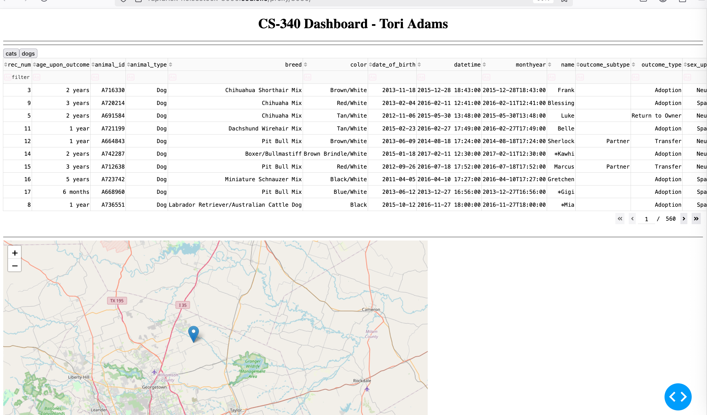

# DashBoardProject

# Functionality 
This is a dashboard app based on Animal Rescue that allows you to filter available animals and their details

# Tech Stack
Python, MongoDB, Dash, DashLeaf
Use CSV details to import the Animals_Shelter database. Create a user/password in the admin db with read/write access to the aac db.
Using Dash as an interface we can import the libraries needed to get data and display it. We use features like Dashleaf for a map and Plotly to show Charts.
in Dash we import the class and then read all the data using a data frame(DF) which can query the Animal_Shelter() component 
The AnimalShelter() will check perform CRUD operation to create, read, update, and delete data that the UI can handle

# Steps
The backend needs to be created first in order to accurately test the data and make sure the fucntionality works. Using Jupyter allows to test functionality of the CRUD statements against the database. Once we get data resonding, then we can setup the UI. Each step should be done in incriments with first just getting the data to display.
Other steps would then be organizing how the data displays on the screen. In the UI, callbacks are added to interact with the database in order to get all the data an display it in a table. Radio buttons are setup in order to toggle and filter the data based on the option selected

#Challenges
Figuring out how to use Dash and Dashleaf and Plotly based on dynamic DB data and not static values

    Describe the required functionality of the project. Include the screenshots or screencast taken while testing and deploying your dashboard (Step 6) as proof that you have achieved the required functionality.
    Describe the tools used to achieve this functionality and a rationale for why these tools were used.
        Be sure to explain why MongoDB was used as the model component of the development, including what specific qualities or capabilities it provides for interfacing with Python.
        Be sure to explain the Dash framework that provides the view and controller structure for the web application.
        Be sure to include links to any resources or software applications that were accessed or used.
    Explain the steps that were taken to complete the project.
    Identify any challenges that were encountered and explain how those challenges were overcome.
