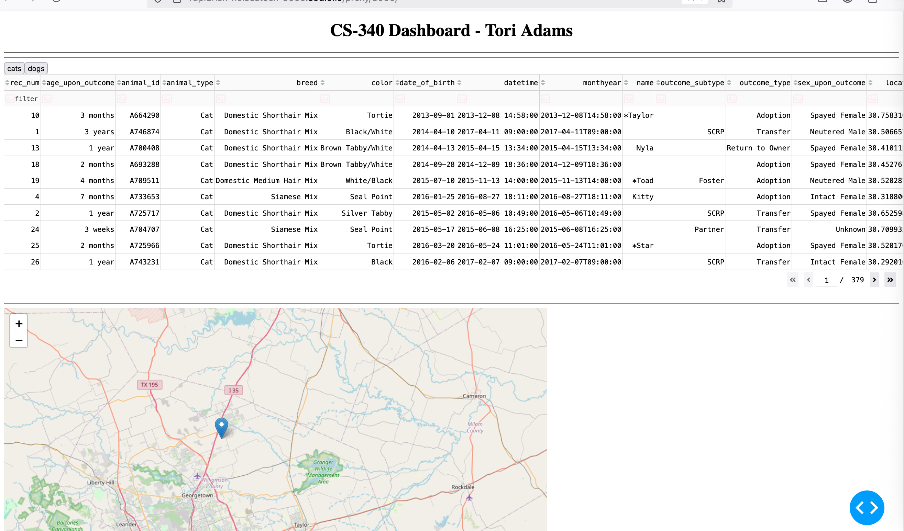
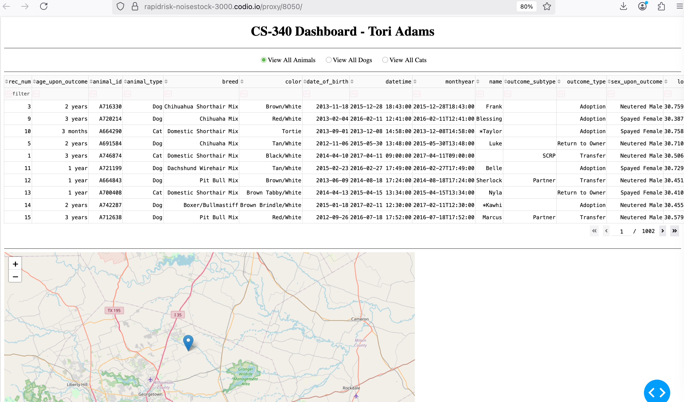
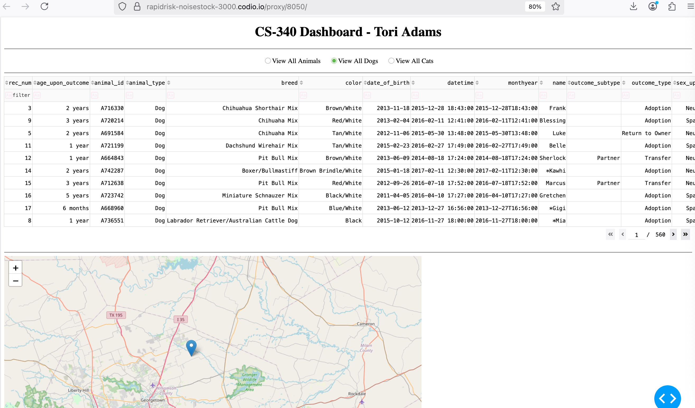
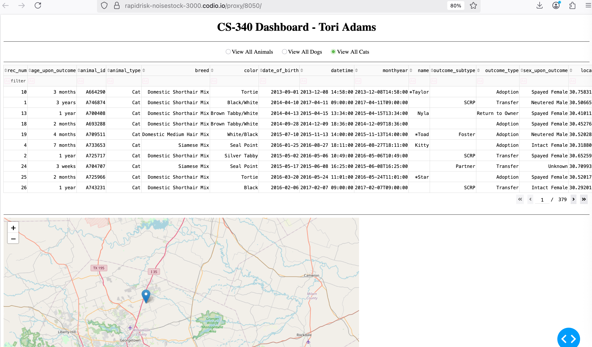
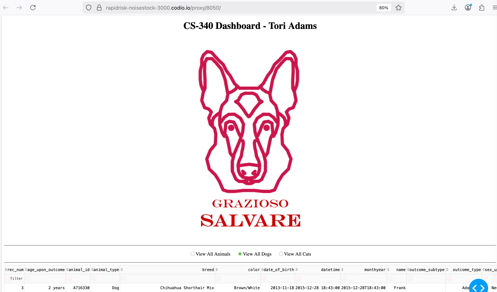
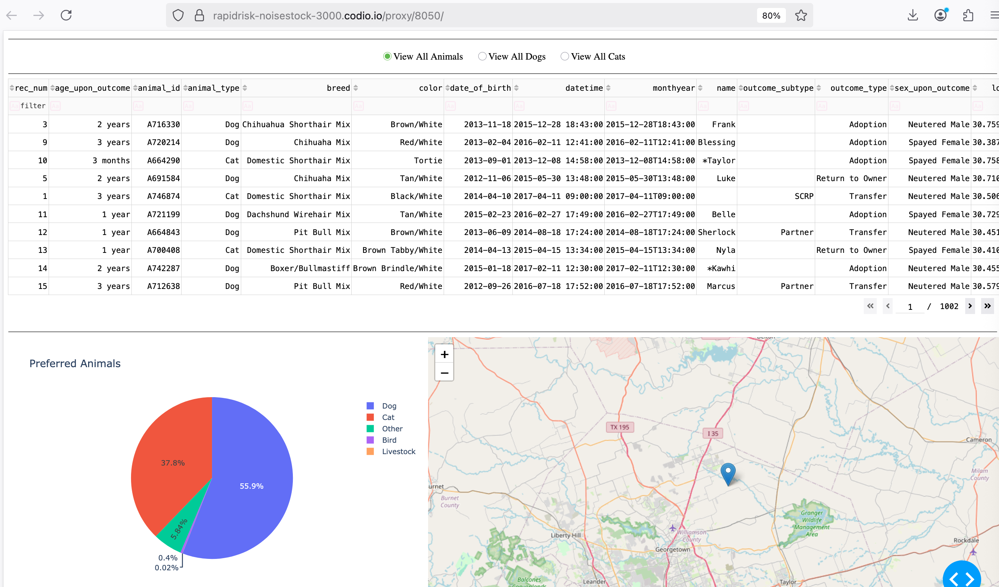
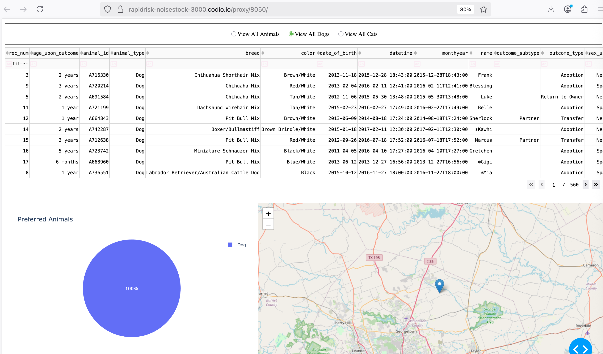
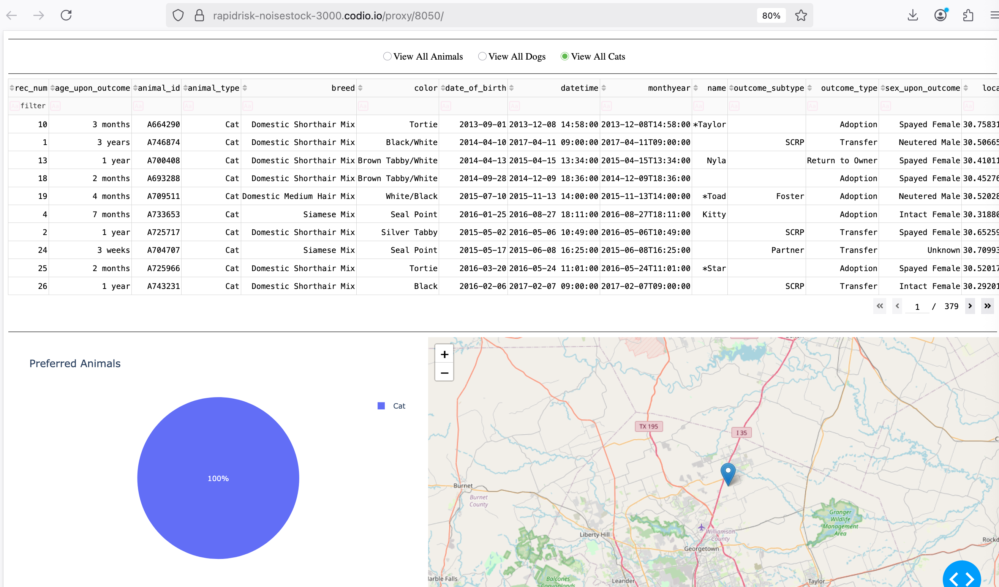

# DashBoardProject

# Functionality 
This is a dashboard app based on Animal Rescue that allows you to filter available animals and their details

# Tech Stack
Python, MongoDB, Dash, DashLeaf
Use CSV details to import the Animals_Shelter database. Create a user/password in the admin db with read/write access to the aac db.
Using Dash as an interface we can import the libraries needed to get data and display it. We use features like Dashleaf for a map and Plotly to show Charts.
in Dash we import the class and then read all the data using a data frame(DF) which can query the Animal_Shelter() component 
The AnimalShelter() will check perform CRUD operation to create, read, update, and delete data that the UI can handle

# Steps
The backend needs to be created first in order to accurately test the data and make sure the fucntionality works. Using Jupyter allows to test functionality of the CRUD statements against the database. Once we get data resonding, then we can setup the UI. Each step should be done in incriments with first just getting the data to display.
Other steps would then be organizing how the data displays on the screen. In the UI, callbacks are added to interact with the database in order to get all the data an display it in a table. Radio buttons are setup in order to toggle and filter the data based on the option selected

# Challenges
Figuring out how to use Dash and Dashleaf and Plotly based on dynamic DB data and not static values

# Computer Science 
    How do you write programs that are maintainable, readable, and adaptable? Especially consider your work on the CRUD Python module from Project One, which you used to connect the dashboard widgets to the database in Project Two. What were the advantages of working in this way? How else could you use this CRUD Python module in the future?
    
    How do you approach a problem as a computer scientist? Consider how you approached the database or dashboard requirements that Grazioso Salvare requested. How did your approach to this project differ from previous assignments in other courses? What techniques or strategies would you use in the future to create databases to meet other client requests?
    
    What do computer scientists do, and why does it matter? How would your work on this type of project help a company, like Grazioso Salvare, to do their work better?
Making programs readable, maintainable, and adaptable is by having naming conventions that explain the function and variables that are descriptive. This allows others who manageing the project to be able to understand how the project runs, along with understanding the features and parts of the projects. Grouping your functions is also helping in readable and adapatable parts of the project. If your project does have CRUD functions, then you can have the functions related to these areas grouped together. When it comes to building into an exisitng project, you don't want to go directly into writing the code, but first think about the logic in how it should function now, and how it could work in the future. When there is a feature that needs to be implemented, then break down feature in pieces. Build in increments, therefore you can also test functionality is working as expected. I am familiar with using the CRUD methhod when it comes to databases whether using them for UI purporse or standalone data purposes. The role of a computer scientist is multifaceted. They have experience in designing and developing hardware, problem solving using algorithms in coding as well. The work involves requires a full scope of being aware what the customer problem is, and being able to solve it throught technology. Being aware in a broad scope of building this project allows computer science to understand different aspects involved in order to meet all requirements to build the project.

